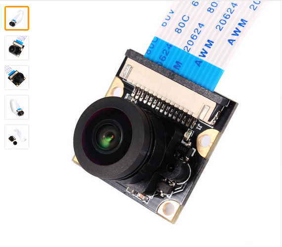
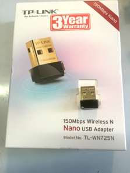
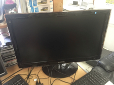
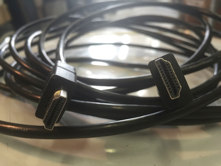
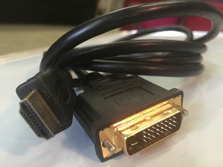
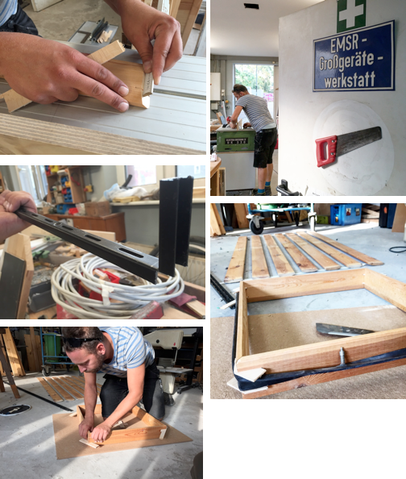
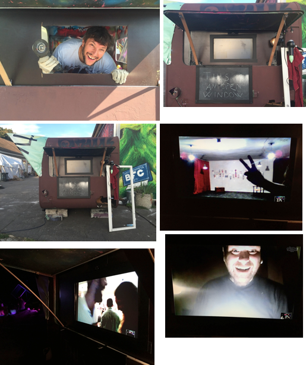
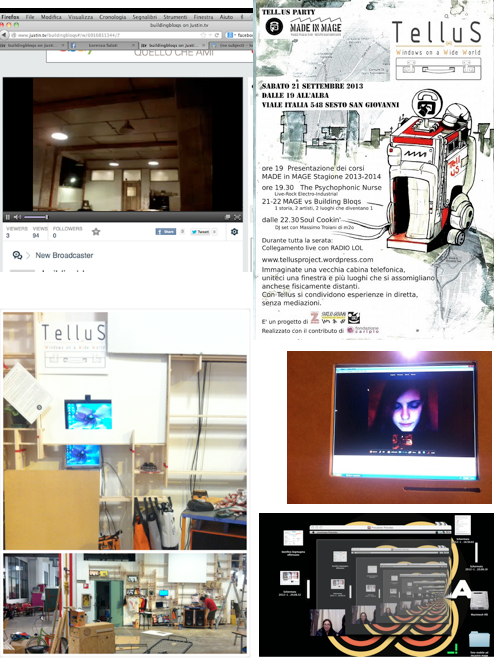

<head>
<meta http-equiv="Content-type" content="text/html; charset=UTF-8">
<meta http-equiv="Content-Language" content="en-us">
<meta name="version" content="6316">

<title>/33890$jSZReBOvYQR</title>
</head>
# 

&nbsp;

## How does it appear?

&nbsp;

It’s a public videochat system to connect different spaces based on Raspberry PI.

It&nbsp; has to look as similar as possible to a “real” window: it has basic&nbsp; user interface and It doesn’t have mouse, keyboard, or other functions.&nbsp; It’s just a “window”.

A window frame with a flat monitor instead of the glass. Speakers are part of the frame on sides. On top there is a webcam with microphone. On the bottom there are three buttons with these labels:

ON/OFF

SELECT

CONNECT/UNCONNECT

&nbsp;&nbsp;

## What can users do?

&nbsp;

1 – you switch on the window. All you need to do is to press the “ON/OFF” button. The window switches on, makes an auto boot and shows a list of all the windows available.

As a window switches on, it automatically becomes visible to other spaces.

(can also show which are “closed”, “open and free for connection”, “open and busy, already connected”, "open and busy without activity in the last hour")

2 – you choose from the list which window you want to connect to with the “SELECT” button. You can choose both “free” and “busy” connections.

&nbsp;

If you choose a “free” connection

3A – you push the “CONNECT/UNCONNECT” button. This starts the connection with the selected window with no need of a manual answer from the other window

If you choose a “busy” connection

3B – you push the “CONNECT/UNCONNECT” button. This sends a connection request to the selected window. To start the connection, a manual answer from the other window is required.

&nbsp;

4 – when you are making a connection with a window and you want to change window, you push the “CONNECT/UNCONNECT”&nbsp; button. (this is not an attempt to make a conference call for more than 2 places) This brings you again to the list of available windows. So, you’re back to the point 2&nbsp;

5 – when you are disconnected without an explicit decision (if the line falls, or so on), the window tries to make a new connection to the previous window for three times. If this fails the window becomes available and comes back to the list with the “free” label.

6 – if a window is already connected and another one tries to connect, it receives a message with the request. If you push the “CONNECT/UNCONNECT” button, the window quits the existing connection and starts a new one

## Building the eWindow
<undefined><li>
<b>BILL OF MATERIALS</b> </li></undefined>

| Description | Notes | Reichelt part # | How many? |
| Raspberry Pi | RPi3 has builtin Wifi :) | RASPBERRY PI 3 | 1 |
| SD-Card | Size? 16gb should be enough | TOS M302R0160EA | 1 |
| USB Powersupply | | NT MUSB 2 SW | 1 |
| Webcam | At least 720p? UVC compatible, with microphone | LOGITECH HD C270 | 1 |
| RPi Camera | Alternative to Webcam | RASP CAM 2 | 1 |
| PiCam Wide Angle Clone | Alternative with Fish eye lense | http://www.ebay.de/itm//221575476514 | 1 |
| USB Microphone | If using PiCam or WebCam w/o mic | | |
| Monitor | how big? | ACER FX0EE.005 | 1 |
| HDMI Cable | how long? 2m? | AK HDMI 1,0G ET | 1 |
| Ethernet Cable | recommended over WiFi | | 1 |
| Speakers | ? | | |
| Buttons | see below | | 3 |

Read here whate developed by the Munich cluster:[Multifactory Project Munich](https://multifactory.hackpad.com/F5xvmQpW6Wy)

## Software

&nbsp;

**Download Raspberry SD Image**

**DOWNLOAD LINK**

Get the Image at [http://ewindow.org/download/ewindow-v0.1.zip](http://ewindow.org/download/ewindow-v0.1.zip)

Unzip the .zip, you get the .img File

install the operating system with the ewindow software installed

[Proceed after the directions of [https://www.raspberrypi.org/documentation/installation/installing-images/](https://www.raspberrypi.org/documentation/installation/installing-images/)&nbsp;

with windows/linux/mac:

Easy Alternative for beginners : Get [https://etcher.io/](https://etcher.io/)

- Insert SD Card
- Start Etcher
- Select Image (.img File)
- Make sure SD Card is selected
- Flash!&nbsp;&nbsp;&nbsp;
<undefined><li>Later on https://g<a href="https://g/">i</a><a href="https://gi/">t</a><a href="https://git/">h</a><a href="https://gith/">u</a><a href="https://githu/">b</a><a href="https://github/">.c</a><a href="https://github.c/">o</a><a href="https://github.co/">m</a><a href="https://github.com/">/</a><a href="https://github.com/">s</a><a href="https://github.com/s">t</a><a href="https://github.com/st">r</a><a href="https://github.com/str">f</a><a href="https://github.com/strf">r</a><a href="https://github.com/strfr">y</a><a href="https://github.com/strfry">/</a><a href="https://github.com/strfry/">e</a><a href="https://github.com/strfry/e">w</a><a href="https://github.com/strfry/ew">i</a><a href="https://github.com/strfry/ewi">n</a><a href="https://github.com/strfry/ewin">d</a><a href="https://github.com/strfry/ewind">o</a><a href="https://github.com/strfry/ewindo">w</a>
</li></undefined>

**Installation / First Bootup**

- Boot the Pi with the flashed SD card
- A Dialog should appear, asking for hostname: Enter xxx.ewindow.org
- v0.1 Image has a bug: Enter OS Shell to fix it:&nbsp;&nbsp;
  - su
  - passwd
  - exit
  - exit&nbsp;
- Config-\>Update
- go to menu-\>wifi-\>ssid: enter name of the network-\>password
- Select Preview and test camera view
- press enter-\>&nbsp;
  - you are back to the menu-\>call Someone -\> enter hostname of remote ewindow -\> fablab.munich.ewindow.org or hei.ewindow.org or werkbox3.ewindow.org, or dresden.ewindow.org

now it appears a text on the left , it ask to enter a password 2 times and the press enter. the password are:

- &nbsp;for hei is heiewindow for werkbox3 is wbewindow, for dresden and fablabmunich is ewindow

Now wait for connection, press enter to hang up

**Requirements**

We need help to develop an easy user interface without keyboard and the use of the buttons. The user interface program sees the status of the network and calls the interconnection program when needed.

The OS is Raspbian (OS based on Debian optimized for Raspberry PI)

&nbsp;

<undefined><li>Software needs</li></undefined>

1 the management of the window

2 the management of the network of all the windows

3 the connection and videochat by itself

&nbsp;

Stable video and audio connection

Small band usage (or automatic band width adaption)

Encrypted connection

&nbsp;

Software for encripted connection

&nbsp;

Examples of Free Software for encrypted video chat (Maybe an optimization of the interconnection program for Raspberry PI)

Tox: there are some clients with video-chat capabilities (only two), may be a little bit programming work, there is no raspbian binary [https://tox.im/](https://tox.im/)

Ekiga: ekiga is available for raspbian and a lot of people run this software on a raspi. To check if this software can control the client via shell-scripting. This is essential for autostart the software and establish a connection with buttons.

Linphone: this videochat software can be used with a shell script.&nbsp;&nbsp; ....

Update Dec2016: Found http://creytiv.com/baresip.htmlLightweight C-programmed SIP User Agent,&nbsp;

<undefined><li><b>Existing Solutions</b></li></undefined>

[http://open3dge.com/polycom-alternative/](http://open3dge.com/polycom-alternative/)

<undefined><li><b>Registration in the E window network</b></li></undefined>
- name of the city -&nbsp; open space - room where is placed the room
- email address for accessing
- password to access the encrypted network
<undefined><li><b>Next Steps</b></li></undefined>
- <s>Figure out streaming server solution with less latency 
(problem probably is in h264_v4l2_rtsp). Check if RTSP is the best 
option, maybe switch to HTTP.</s>
- <s>Add audio streaming from camera microphone to the stream server ^</s>
- Develop a Qt client application. Promising technology base: https://github.com/carlonluca/piIntegrates omxplayer as QML Surface in Qt. Would be a perfect match if this works)
- <s>Write a (Qt) client with software button that is independent from Pi.</s>
- Write a Web client with software button that is independent from Pi.
- Design and implement client selection feature
- Design and implement call intercept
- Make current design boot-persistent. Fix existing init sc
- ripts or switch to systemd units. <s>Fix loading of v4l2loopback kernel module</s>
- <s>Add support for PiCam</s>
- Write a configuration assistant. Should query IP, name, PSK, type of camera, type of microphone, number and pin configuration of buttons

Nice to have, for the future

<s>* Desktop client for testing and temporary participation (probably Linux only) </s>Comes with web client

\* Adaptability for different button/UI concepts for individual windows

\* Some way for spaces to customise their appearance in contact list (Logo/Text). Also a UI concern.

&nbsp;

<undefined><li><b>Alternative Approach with <a href="https://en.wikipedia.org/wiki/WebRTC">WebRTC</a>  </b></li></undefined>

The WebRTC specifications offers a nice stack of sensible protocols for Videochat.

http://orm-chimera-prod.s3.amazonaws.com/1230000000545/images/hpbn\_1803.png

http://chimera.labs.oreilly.com/books/1230000000545/ch18.html

It is possible to be used without a browser as a client, using Janus: https://github.com/meetecho/janus-gateway

Tutorial for Raspberry Pi: http://www.rs-online.com/designspark/electronics/blog/building-a-raspberry-pi-2-webrtc-camera

It works very nice with low latency on a Pi 1 streaming to a Firefox Browser client.

What is needed (and Jonathan can do):

- A plugin to dump incoming RTP stream to omxplayer
- Add gstreamer commands for sending audio
- <s>If an external Webcam shall be used, it can be done with 
gstreamers omxh264enc. Allthough there is a streaming issue with missing
 SPS/PPS headers.</s>

Further necessary, needs exchange with other developers:

- A specification for session protocol (WebRTC requires to use JSON based protocols for session init / key exchange)
- A server script for listing available clients
- A client script controlling janus through REST API, and starting gstreamer
- (A browser client, probably easy but requires some web development skills)

more informations about WEBRCT :

http://iswebrtcreadyyet.com/

<undefined><li><b>UV4L</b></li></undefined>

UV4L is a driver for the RasPiCam (among others), that ships a WebRTC implementation:

http://www.linux-projects.org/modules/sections/index.php?op=viewarticle&artid=17

It also offers integration with the Janus server:

http://www.linux-projects.org/modules/sections/index.php?op=viewarticle&artid=16#example17

Open Questions:

- Does it support audio? It seems it does, the documentation (man uv4l-server ) mentions lots of audio stuff
- How to render UI on top of video output. Can we implement an UI when using&nbsp;

- &nbsp;--webrtc-receive-video=yes&nbsp;

<undefined><li><b>Janus WebRTC Gateway</b></li></undefined>

https://janus.conf.meetecho.com/docs/FAQ.html

- Which plugin will we use? Video Call, Video Room or our own?
- Concern: Don’t stream our audio/video to users we are not seeing

[Jonathan Sieber](https://multifactory.hackpad.com/ep/profile/smY3q55NWop) email to Lorenzo Miniero:

I’m currently evaluating if Janus can be used as a foundation for implementing a WebRTC client on a Raspberry Pi.

The streaming plugin comes quite close to what i need for my application&nbsp; 1), but i can’t simply run it locally, because the device sits behind&nbsp; NAT.

A working solution is to run the streaming server on a publicly reachable server, but this has drawbacks:

- The plain RTP stream is not encrypted nor authenticated

- The server needs to re-transmit the stream to the viewer

A nicer solution would be if the local streaming plugin could connect to a video room/call on the public server.

I saw that a plugin can initiate a RTC connection in an established&nbsp; session by calling push\_event() with a JSEP/SDP offer, but there doesn’t&nbsp; seem to be an API to create an entirely new session from within Janus.

Is this possible in some way? I guess this would require some modification of the Janus core. Where would i start?

lorenzo miniero (janus developer) answer:&nbsp;

"No, **<u>Janus is and remains a serve</u>r** , so it only creates a session if&nbsp; you ask it to. <u>What you can try </u>is to have a signalling intermediary,&nbsp; co-located with Janus, that acts as the client you need and has all the&nbsp; client logic, instructing the Janus instance accordingly ("I want to do a&nbsp; call, create this plugin session for me and prepare this offer I can&nbsp; send to the other side"). So basically, <u>having something that allows 
you  to use Janus as a "media agent" of some sort, so that you can 
receive  the SDP offer from Janus which you can then send yourself 
wherever it  needs to go</u>.

If you need this within Janus, I&nbsp; guess one way to do so is to either modify an existing transport plugin&nbsp; or write a new one, but that’s probably not needed, as it could be this&nbsp; new "client proxy" that would actually originate messages to communicate&nbsp; with the remote end, while interaction with the local Janus could reuse&nbsp; what’s already available."

Another application 2), would be <u>to extend the streaming plugin to also  handle incoming audio/video </u>data, and put it into a local GStreamer&nbsp; output pipeline<u> to create a simple bi-directional client</u>.

"I’ve been thinking for a while about a gstreamer-based plugin, that&nbsp; is, something where you can configure a gst pipeline somewhere that&nbsp; gets attached to the PeerConnection the user created with the plugin&nbsp; itself. This would not be an extension to the Streaming plugin, though,&nbsp; as I’d rather keep functionality separated as much as possible (the&nbsp; Streaming plugin is not meant to be bidirectional). Anyway, because of a&nbsp; constantly busy schedule and other things, I never managed to find time&nbsp; to start looking into this, so not sure when I’d be able to do so&nbsp; myself." (LM)

This would be the first WebRTC client running on a Pi, besides the UV4L&nbsp; server (which is closed-source, and therefore would be at most a second&nbsp; choice for this project).

This approach poses the same problem, making a connection to another&nbsp; Janus server, from where incoming and outgoing calls would be processed.

"Yep, as I mentioned before, the easiest approach is a companion&nbsp; "controller" that can instruct Janus via its API, while keeping the&nbsp; decisions on what to do and who to talk to to itself. Since it would be a&nbsp; very lightweight component, I assume it would have no impact on the low&nbsp; resources of the Pi anyway." (LM)

I would appreciate some guidance in this endeavour. Although Janus is&nbsp; probably not designed for this purpose, it has a nice codebase and&nbsp; probably already implements 98% of what is needed on the transport&nbsp; layer. (JS)

<undefined><li><b>PeerVPN</b></li></undefined>

http://p[e](http://p/)[e](http://pe/)[r](http://pee/)[v](http://peer/)[p](http://peerv/)[n](http://peervp/)[.n](http://peervpn/)[e](http://peervpn.n/)[t](http://peervpn.ne/)

- Solves the NAT traversal problem, so we don’t need the ICE/STUN/TURN part of WebRTC stack
- Adds another layer of encryption
- Allows SSH access to all peers (to allow remote management/updates if users want it)

**USER INTERFACE**

We think we need 2 user interfaces:

- 1 embedded into the "real Ewindow"&nbsp;

- "Embedded" User Interface (maybe use Qt/QML: http://www.qt.io/qt-quick/ )
- Depends on compatibility with uv4l’s video output
- OMX Backend for Qt/QML: #t[a](https://multifactory.hackpad.com/ep/search/?q=%23t&via=jSZReBOvYQR)[s](https://multifactory.hackpad.com/ep/search/?q=%23ta&via=jSZReBOvYQR)[k](https://multifactory.hackpad.com/ep/search/?q=%23tas&via=jSZReBOvYQR)
- [&nbsp;](https://github.com/carlonluca/pi)https://github.com/carlonluca/pi

- 1 for browser, when we want to establish a temporary window in a normal laptop

- HTML/CSS/JS-based

## Hardware

&nbsp;

Here a check list of materials needed to build one window:

&nbsp;

1X raspberry pi2

1X power adaptor for raspberry PI (2A is ok)

&nbsp;

<s>1X
 webcam (it has to operate with raspberry pi - check the model) – TIP: 
the model in picture (Genius WideCam F100) is a 120-degree ultra wide 
angle Full HD Conference Webcam, is tested, has good performances both 
for audio and video and works with Raspberry PI2. It can be easily found
 in major stores as Conrad (more or less 40€). </s>(obsolete, we are using the PiCam)

http://www.aliexpress.com/item/New-Camera-Module-Board-5MP-175-Degree-Wide-Angle-Fish-Eye-Lenses-For-Raspberry-Pi/32576233947.html

(search on aliexpress.com for: "Raspberry Pi Camera Wide Angle")

When using the PiCam, we also need an extra USB Microphone:

http://www.aliexpress.com/item/New-Mini-USB-Flexible-Stereo-Microphone-for-PC-Laptop-Mac-DEC18/32575303289.html

&nbsp;

1X wlan dongle (it has to operate with raspberry pi - check the model) – TIP: the model in picture (TP-LINK Nano USB Adapter 150 Mbps mod. TL-WN725N) is tested and works with Raspberry PI2. It can be easily found in major stores as Conrad (more or less 10€).

1X tft screen with HDMI input&nbsp; because raspberry pi has HDMI output (OR with DVI input)&nbsp;

&nbsp;

1X HDMI cable (if the tft-screen has dvi input, use HDMI-DVI cable)

&nbsp;

1X pair of speakers WITH amplifier and analog volume control (if the monitor has not HDMI)

1X on-off switch

2X one-way button (select and connect/unconnect)

https://www.asi-ez.com/pix/illustrations/LovatorSwtiches\_Email.JPG

1X SD card (minimum 4GB)

1X usb keyboard + mouse (to upload the OS and program)

STEPS TO DEVELOP THE HARDWARE PART

1. create a repository on github https://help.github.com/articles/create-a-repo/
2. CREATE a common desktop appearence (user interface)

## Network Architecture

For technical reasons, we registered ewindow.org through the provider 1fire.de

Cost is 16€/Year, [paid by \<jonathan]

## Box and design

&nbsp;

Metal, wood, wheels (to move the window if needed)

The box should be similar to a real window. The window should fit the tft screen, as Raspberry PI is very small.

We are making 2 prototypes with Steppy from Machbar freiland

&nbsp; 

&nbsp;

&nbsp;

<undefined><li>Some experiments and trials</li></undefined>

&nbsp;

&nbsp; 

&nbsp;

<undefined><li>MONOKULTUR,
 Silent disco (3 channels) party. Open window from/to: 
freiland-Potsdam/The Garage-Greece. Duration: one night on August 29, 
2015</li></undefined>

<undefined><li>SCRAP BECOME STAFF, upcycling contest, Prize giving. </li>
<li>Duration: 2 hour, on July 4, 2015</li>
<li>Open window from/to: freiland-Potsdam/Venice.</li>
<li>Partner : www.lamentecomune.it</li></undefined>

&nbsp;

&nbsp; 

<undefined><li>Milano Citta’ Mondo – art exhibition</li>
<li>Duration: 2 weeks, 11.00-19.00, from March 25 to April 6 2015 </li>
<li>Open window from/to: Potsdam/Dresden/Milano.</li></undefined>

&nbsp;

&nbsp; 

&nbsp;

MEET IN MAGE and others events at MAGE

Duration: 10 different events between 2013 and 2014

Open window from/to: BIGMAGMA MILANO/another place

## MUNICH CLUSTER 

**Work session Munich 29.08 - 04.09. 2016**

**proposed** by [lorenza@](https://multifactory.hackpad.com/ep/profile/CEKcjeaqYQz)osunwes.eu and Giulio&nbsp;

**supported** by Verbund offener Werkstätten e.V.

http://www.offene-werkstaetten.org/seite/multifactory-netzwerk

**funded** by anstiftung [(www.anstiftung.de](https://www.anstiftung.de/))

<undefined><li>
<b>Timetable</b><table style="font-size:13px;cell-spacing: 0px; border-collapse: collapse;"><tbody>
<tr>
<td style="border:1px solid #999; min-width: 50px;height: 22px;line-height: 16px;padding: 0 4px 0 4px;" class="added">Monday 29.08.</td>
<td style="border:1px solid #999; min-width: 50px;height: 22px;line-height: 16px;padding: 0 4px 0 4px;" class="added">18.00-20.00</td>
<td style="border:1px solid #999; min-width: 50px;height: 22px;line-height: 16px;padding: 0 4px 0 4px;" class="added">presentation</td>
<td style="border:1px solid #999; min-width: 50px;height: 22px;line-height: 16px;padding: 0 4px 0 4px;" class="added">at HEi (open to everybody)</td>
</tr>
<tr>
<td style="border:1px solid #999; min-width: 50px;height: 22px;line-height: 16px;padding: 0 4px 0 4px;" class="added">Wednesday 31.08.</td>
<td style="border:1px solid #999; min-width: 50px;height: 22px;line-height: 16px;padding: 0 4px 0 4px;" class="added">17.00-21.00</td>
<td style="border:1px solid #999; min-width: 50px;height: 22px;line-height: 16px;padding: 0 4px 0 4px;" class="added">window</td>
<td style="border:1px solid #999; min-width: 50px;height: 22px;line-height: 16px;padding: 0 4px 0 4px;" class="added">at werkbox³</td>
</tr>
<tr>
<td style="border:1px solid #999; min-width: 50px;height: 22px;line-height: 16px;padding: 0 4px 0 4px;" class="added">Thursday 01.09.</td>
<td style="border:1px solid #999; min-width: 50px;height: 22px;line-height: 16px;padding: 0 4px 0 4px;" class="added">17.00-21.00</td>
<td style="border:1px solid #999; min-width: 50px;height: 22px;line-height: 16px;padding: 0 4px 0 4px;" class="added">window</td>
<td style="border:1px solid #999; min-width: 50px;height: 22px;line-height: 16px;padding: 0 4px 0 4px;" class="added">at werkbox³/Maker Lab</td>
</tr>
<tr>
<td style="border:1px solid #999; min-width: 50px;height: 22px;line-height: 16px;padding: 0 4px 0 4px;" class="added">Friday 02.09. if necessary</td>
<td style="border:1px solid #999; min-width: 50px;height: 22px;line-height: 16px;padding: 0 4px 0 4px;" class="added">17.00-?</td>
<td style="border:1px solid #999; min-width: 50px;height: 22px;line-height: 16px;padding: 0 4px 0 4px;" class="added">window</td>
<td style="border:1px solid #999; min-width: 50px;height: 22px;line-height: 16px;padding: 0 4px 0 4px;" class="added">at Maker Lab</td>
</tr>
<tr>
<td style="border:1px solid #999; min-width: 50px;height: 22px;line-height: 16px;padding: 0 4px 0 4px;" class="added">Saturday 03.09.</td>
<td style="border:1px solid #999; min-width: 50px;height: 22px;line-height: 16px;padding: 0 4px 0 4px;" class="added">11.00-18.00</td>
<td style="border:1px solid #999; min-width: 50px;height: 22px;line-height: 16px;padding: 0 4px 0 4px;" class="added">video-workshop</td>
<td style="border:1px solid #999; min-width: 50px;height: 22px;line-height: 16px;padding: 0 4px 0 4px;" class="added">at HEi</td>
</tr>
<tr>
<td style="border:1px solid #999; min-width: 50px;height: 22px;line-height: 16px;padding: 0 4px 0 4px;" class="added">Sunday 04.09.</td>
<td style="border:1px solid #999; min-width: 50px;height: 22px;line-height: 16px;padding: 0 4px 0 4px;" class="added">11.oo - 18.00</td>
<td style="border:1px solid #999; min-width: 50px;height: 22px;line-height: 16px;padding: 0 4px 0 4px;" class="added">video-workshop</td>
<td style="border:1px solid #999; min-width: 50px;height: 22px;line-height: 16px;padding: 0 4px 0 4px;" class="added">at Maker Lab</td>
</tr>
</tbody></table>
</li>
<li><b>At HEI</b></li></undefined>

<undefined><li><b>At Werkbox³</b></li></undefined>

[D: Box and design](https://multifactory.hackpad.com/jSZReBOvYQR#:h=Box-and-design)

<undefined><li><b>At MUNICH MAKER LAB</b></li></undefined>

<undefined><li><b>E-window</b></li></undefined>

[development of the betaversio](https://multifactory.hackpad.com/Multifactory-Project-Munich-F5xvmQpW6Wy)N Software architecture of the software needed for running the E-window videochat system&nbsp;

<undefined><li><b>mutlifactorynetwork website</b></li></undefined>
- register the new domain ww.multifactorynetwork.org
- choose the template

free social network themes with Buddy Press plugin:

for feedbacks form hosts and hosted people

[https://www.wpmultiverse.com/blog/free-buddypress-themes/](https://www.wpmultiverse.com/blog/free-buddypress-themes/)

[http://wowfreethemes.com/themes/evolve/](http://wowfreethemes.com/themes/evolve/)

[https://wordpress.org/themes/business-world/](https://wordpress.org/themes/business-world/)

- write the application form for people willing to go to a space&nbsp;
- write the application form for spaces willing to become part of the network
- "MEMBER OF MULTIFACTORY NETWORK" graphic log
- space gingle

&nbsp; **Work session Munich 13.11 - 17.11 2016**

VIDEO TUTORIALS, SELF PRESENTATIONS, JINGLE SHOOTINGS, WALK AROUND, BETA VERSION E-WINDOW SOFTWARE

&nbsp;

| DAY | WHO | WHERE | WHAT | WITH |
| Sunday 13.11 | lorenza and felix | | | |
| Monday 14.11 | felix | FABLAB | Videotutorial | |
| Tuesday 15.11 | felix | FABLAB/around the town | selfpresentation | |
| Wednesday 16.11 | | | install beta version e-w software / jingle | |
| Thursday 17.11 | | | install beta version e-w software / jingle | |

&nbsp;&nbsp;&nbsp;&nbsp;&nbsp;&nbsp;&nbsp;&nbsp;

## Contacts/collaborators

- pikkolo Torino (webdeveloper bigmagma website) www.fullstackagency.it

- fullstack agency roma&nbsp;

[start up](http://www.woogon.com/):http://www.woogon.com/[&nbsp;](http://www.woogon.com/)

- heigenbaukombinat&nbsp;&nbsp;

- makerspace leipzig
- NIKO K guy with the server in Dresden

- luca cerisola developer of UV4L&nbsp; . not interested in collaborating now. maybe when well will have the beta version, if we will still use his UV4L

- fablab Bottrop professor : Michael.Schaefer@hs-ruhrwest.de

http://www.hochschule-ruhr-west.de/forschung/fachbereich-1/institut-informatik/beschaeftigte/prof-dr-michael-schaefer/

- &nbsp; **DMK E-BUSINESS GmbH** &nbsp;&nbsp;

&nbsp;[\<tom.starke@dmk-ebusiness.com\>](mailto:tom.starke@dmk-ebusiness.com)

&nbsp;[http://www.dmk-innovations.de](http://www.dmk-innovations.de/)

&nbsp;Web: <u><a href="http://www.dmk-ebusiness.de/">www.dmk-ebusiness.de</a></u>

**&nbsp;** Headquartered Chemnitz:&nbsp;&nbsp;

&nbsp;Dresdner Straße 40&nbsp;&nbsp;

&nbsp;09130 Chemnitz / Germany&nbsp;&nbsp;

- bruha.krysrof@gmail.com&nbsp;&nbsp; (met at ZKU open day berlin)
- Lorenzo Miniero, Developer of Janus WebRTC Gateway

[https://webrtchacks.com/webrtc-gw/](https://webrtchacks.com/webrtc-gw/)

- andreas kopp Munich - he doesn’t know webrtc&nbsp;

SIMILAR PROJECTS

Polycom&nbsp; but the purpose is different

www.polycom.com

Found through http://open3dge.com/polycom-alternative/

- Fablab Foundation uses something EWindow-like for their video classes: http://fab.cba.mit.edu/about/video/
  - It is based on H.323/SIP (like Ekiga et al)
  - Software client or Telepresence Hardware from PolyCom or Lifesize

**insights**

webRCT

http://iswebrtcreadyyet.com/

[audio and video streaming from a Raspberry Pi to a remote or local WebRTC-compatible-browser](https://planb.nicecupoftea.org/2015/10/17/hackspace-hat-quick-install-or-audio-and-video-streaming-from-a-raspberry-pi-to-a-remote-or-local-webrtc-compatible-browser/)&nbsp;

## Archive

<undefined><li><b>h264_v4l2_rtspserver solution</b></li></undefined>

Developed in Nov 2015 at [#Rosenwerk](https://multifactory.hackpad.com/ep/search/?q=%23Rosenwerk&via=jSZReBOvYQR) Festival

After much investigation, no usable SIP Video Chat solution was found.

I&nbsp;&nbsp; tried to approach the problem from another angle and use a simple&nbsp; video&nbsp; streaming solution, maybe with RTSP protocol. I propose this&nbsp; streaming&nbsp; server, suitable for Raspberry Pi, like this:&nbsp;

[https://github.com/mpromonet/h264\_v4l2\_rtspserver](https://github.com/mpromonet/h264_v4l2_rtspserver)

The issue of Encryption and Connection Relaying is solved with a VPN software. I suggest a lightweight VPN like [http://peervpn.net](http://peervpn.net/)(because i know the developer and can kick him in case of problems)

Synchronously starting the stream viewers is on behalf of our software

Open Problems:

- Severe video latency of several seconds
- No Audio support in this software
- No real Server yet, no user interface for switching connection

Because our webcam does not support H264, we need a hack. If the Cam support H264, skip to 3):

0) Install Pi Linux Kernel with Headers

- sudo apt-get install linux-image-rpi2-rpfv linux-headers-rpi2-rpfv

- Add this to /boot/config.txt (Check and update version numbers if necessary)

- kernel=vmlinuz-3.18.0-trunk-rpi2
- initramfs initrd.img-3.18.0-trunk-rpi2 followkernel

- reboot

1) Install v4l2loopback

- [git clone](https://github.com/umlaeute/v4l2loopback)[https://github.com/umlaeute/v4l2loopback](https://github.com/umlaeute/v4l2loopback)
- cd v4l2loopback; make
- insmod v4l2loopback.ko

TODO: Make this persistent

2) Use v4l2tools to re-encode the stream in H264 to a virtual Webcam

- [git clone](https://github.com/mpromonet/v4l2tools)[https://github.com/mpromonet/v4l2tools](https://github.com/mpromonet/v4l2tools)
- cd v4l2tools
- # Install dependencies
- sudo apt-get install liblog4cpp5-dev libv4l-dev
- make v4l2compress\_h264
- ./v4l2compress\_h264 /dev/video0 /dev/video1 -W 320 -H 240 -F 5

3) Setup the streaming server

- git clone [https://github.com/mpromonet/h264\_v4l2\_rtspserver](https://github.com/mpromonet/h264_v4l2_rtspserver)
- cd h264\_v4l2\_rtspserver
- sudo apt-get install cmake libx264-dev liblivemedia-dev&nbsp;
- cmake .
- make
- ./h264\_v4l2\_rtspserver /dev/video1

4) Check stream with omxplayer rtsp://localhost:8554/unicast

5) Setup PeerVPN Instance

- wget [http://www.peervpn.net/files/peervpn-0-043.tar.gz](http://www.peervpn.net/files/peervpn-0-043.tar.gz)
- tar xzf peervpn-0-043.tar.gz
- cd peervpn-0-043
- sudo apt-get install libssl-dev
- make

-   

Create a config (elektricwindow.conf) file with this content:

- networkname elektricwindow
- psk mytopsecretpassword
-   
- initpeers 81.169.251.196 7000
- interface peervpn0
- ifconfig4 10.0.0.2/24
- port 7000
- enableipv4 yes
- [#enablerelay](https://multifactory.hackpad.com/ep/search/?q=%23enablerelay&via=jSZReBOvYQR) no
- enableprivdrop no
-   

Enter the assigned IP address and change to the given password

Then start:

- sudo ./peervpn elektricwindow.conf
-   

[https://github.com/strfry/elektricwindow](https://github.com/strfry/elektricwindow)

eleKtronic window organization:

[https://github.com/organizations/eleKtronicwindow/repositories/new](https://github.com/organizations/eleKtronicwindow/repositories/new)

**CONTACTS:**

lorenza : lorenza@osunwes.eu

jonathan : mail@strfry.org

skype : multifactory.model

next steps:

https://windowthroughwall.hackpad.com/NEXT-STEPS-IleuU9LLHUN

