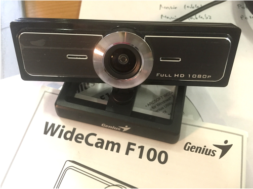
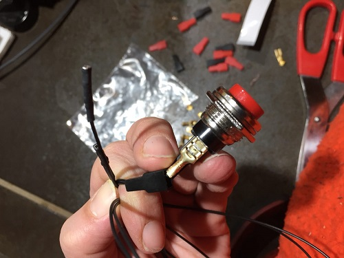

## Raspberry Pi 3 + power

Raspberry PI + 1X power adaptor (2A is ok)

## Webcam

1X webcam (it has to operate with raspberry pi - check the model) – TIP: the model in picture (Genius WideCam F100) is a 120-degree ultra wide angle Full HD Conference Webcam, is tested, has good performances both for audio and video and works with Raspberry PI2. It can be easily found in major stores as Conrad (more or less 40€).

## Speakers
1X pair of speakers WITH amplifier and analog volume control. 

## Monitor

## HDMI Cable

1X HDMI cable (if the tft-screen has dvi input, use HDMI-DVI cable)

## Button

To use the ewindow, you will need to connect a button between GPIO 3 and Ground. Refer to [https://pinout.xyz] to find it.

If you would like to improve the audio/video quality:
- Raspberry PiCam //wide-angle version recommended//
- USB Speakerphone //will replace speakers and microphone//
