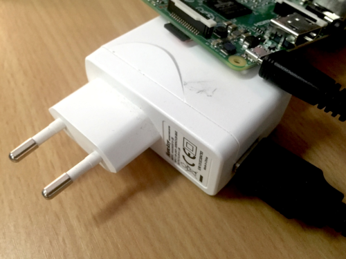
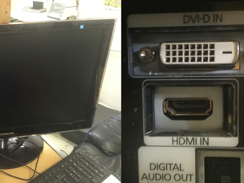
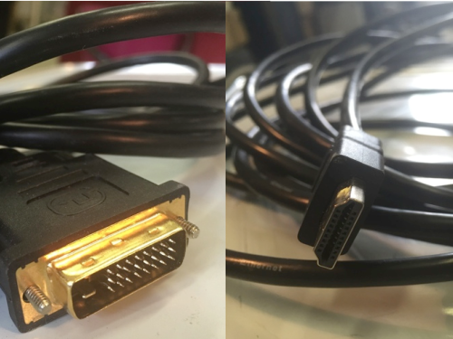

## Raspberry Pi 3

## Raspberry Pi Universal Powersupply

## Raspbeery Pi Camera module V2

## a micro SD Card 16Gbyte size
recommended devices: Samsung (don't use sandisk)

## a USB Stick 32MByte size or larger (every eWindow ned its USB stick with all data on it)

## Speakers
1X pair of Jabra speakers WITH amplifier (for anti echo cancellation) and analog volume control (for an easy control of the volume). 

## Monitor

## HDMI Cable

1X HDMI cable (if the tft-screen has dvi input, use HDMI-DVI cable)
