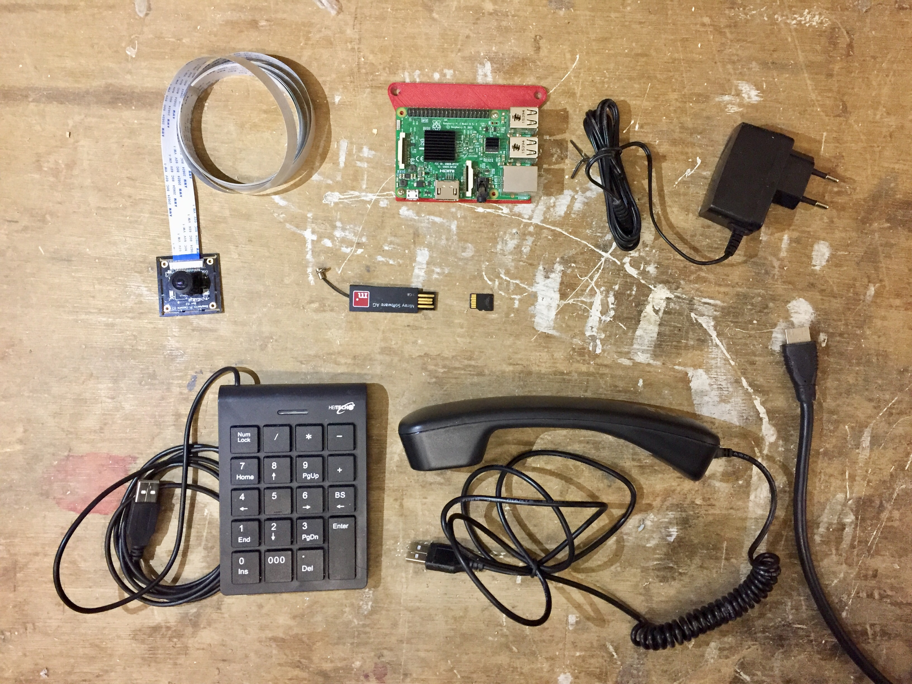

All you need for setting up the electronic parts of the eWindw is:

#### 1. Raspberry Pi 3

#### 2. Raspberry Pi Universal Powersupply

#### 3. Raspbeery Pi Camera module V2

#### 4. Micro SD Card 16Gbyte size. Recommended device: Samsung (don't use sandisk !)

#### 5. USB Stick 32MByte size or larger (every eWindow neds its USB stick with all data saved on it)

#### 6. Speakerphones 1X pair of speakers WITH amplifier (needed for echo cancellation) and analog volume control (for an easy control of the volume). Recommended device: JABRA 510

#### 7. Monitor

#### 8. HDMI Cable

#### 9. Keypad (for calling other eWindows or ToxBlinkenwalls)
