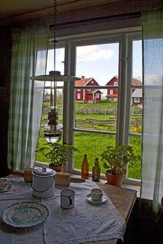
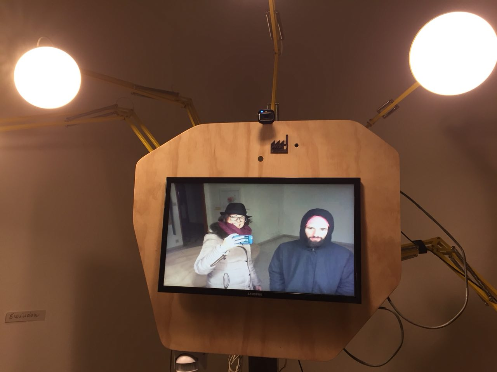
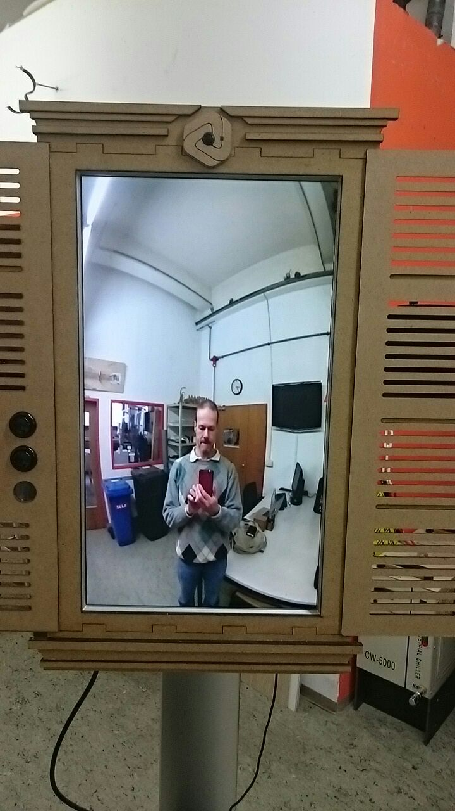
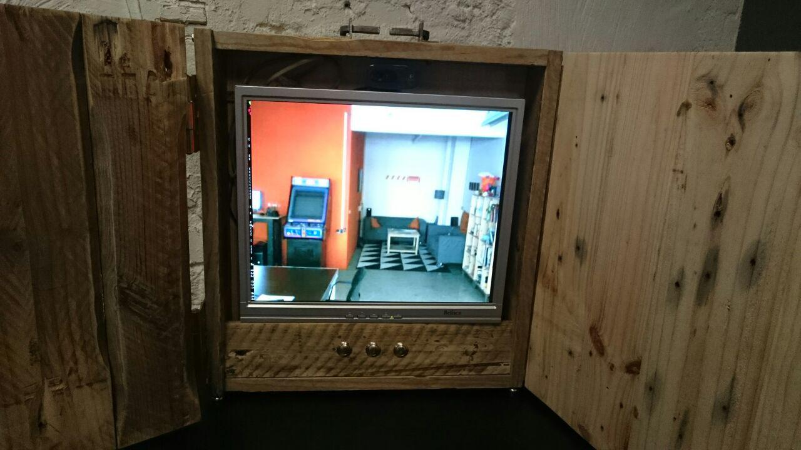

# What is it?

# Ewindow is a TECHNOLOGICAL DEVICE 
for a NEW REVOLUTIONARY __Social Network__ 

### 1. __OPEN SOURCE__ 
// the code is here [ewindow Code](https://github.com/strfry/ewindow) enjoy it //
### 1. __DECENTRALISED__ 
// no central control owned by some big corporation using for other purposes your data //
### 1. __FREE__ 
// It can be set up with low-cost technologies (Raspberry Pi, a speakers,a flat monitor, a webcam with microphone) and is a dedicated single-app device, not a desktop computer or a smartphone.

# Why we started this project based on free software?
-->     WE BELIEVE it is time to do a STEP BACK and RETHINK on how to use technologies for comunication purposes:

### The E-window is based on a free Open Source software and accessible to everybody as we strongly believe that a free software communication platform is necessary to protect freedom of speech and e-democracy. 
#### And it’s easy and cheap to build it by yourself of an estimated cost around 300 euros. 
#### It can be replicated anywhere in the world with no hardware problems. 
#### We would like to spread it in the South of the World to have direct and non-mediated communication with startups and local entrepreneurs, build partnerships between peers, build a decentralised communication system, non depending on top down policies. 

It is a tunnel for comunication you find is physical spaces.
## it is like a window in a wall:

##### We think this tool can break down physical, political and mnemonic walls.

# THE STORY

After some years of trials and experiments on instant communication we decided it was time to do something bigger and we involved the Verbund Offener Werkstaetten (D) which decided to join us in the long process of making the community and spreading awarness around this theme.

Then, to maintain the software development we created a small company TEILWERK.

## How does it work?

Many different EWindows, all togheter, can make their own social network. Imagine you want to connect 3 different spaces. 
Every space has its own window in a common area, like in the coffebreak, a corridor, the kitchen.
With the press of a button, the EWindow will connect to another EWindow in the same network.
Once the Window is opened, there is a # 1:1 encrypted connection. 

### And why don't just use skype or slack or any other existing video chat software? 
To make a skype call, you have to ALREADY know who you're calling and their contact information. With the electronic window, you can easily interact with people you've never met before. But you might have seen their video tutorial online...

Of course for this end, we had to develop a user-friendly interface that requires no mediators such as a keyboard or a mouse. 

The E-windows are based on a software which runs on affordable technologies ( such as Raspberry Pi *raspberryPi is a open-source hardware computer. is like a small computer that you can use for prototyping.*, a flat monitor, a webcam, Linux ). 
The OS is Raspbian which is a free operating system, optimized for the Raspberry Pi hardware, that coincides with the open standards as in public, transparent and accessible to everyone . It provides an encrypted and secure connection as we strongly believe in freedom of speech.
It is also optimized to be efficiently used on most hardware from single board computers such as the raspberry pi to high end pc’s.  And it facilitates further experimentation with new hardware of software features.

To build the e-window , you need a monitor , a small computer such raspberry pie 2, a webcam and a pair of speakers. All the E–window need to operate after is a Stable video and audio connection  and Small band usage (short bandwidth). The appearance is customizable  and could easily be altered and adjusted .

DESIGN DEVELOPMENT 
========================================

*FRAME  
There is no one frame, every space build his own.

# Have a look to some existing frames:

done by Fabrizio

done by Felix

The HEI MUNICH 

done by HEI Team

*ELECTRONICS
- A Raspberry Pi //3 (2 is ok too)//
- 2 GiB  SD Card
- Monitor (with Cable)
- Speakers //CONNECTED VIA JACK, AND NO VIA USB//
- USB Webcam with microphones 
- A button and a bit of jumpwire

---
If you would like to improve the audio/video quality:
- Raspberry PiCam //wide-angle version recommended//
- USB Speakerphone //will replace speakers and microphone//

SOFTWARE DEVELOPMENT
===========

## How is it implemented?

Development of the EWindow is focused on three parts:

1) Enhancing a lightweight SIP Video Phone with Raspberry Pi support

    git clone https://github.com/alfredh/baresip
    
2) A Qt/QML-based user interface

    git clone https://github.com/strfry/ewindowui

3) Configuration details for a specific platform
    
    git clone https://github.com/strfry/ewindowui
    
    
 To Download the Image  
========

[https://ewindow.org/download/ewindow-v0.3.zip]: https://ewindow.org/download/ewindow-v0.3.zip "Get the Image for Raspberry Pi here"
[https://ewindow.org/download/ewindow-v0.3.zip]

Unpack the archive, and write the .img to the SD card.
If you don't know how to do that, use [etcher.io](http://etcher.io)

## Button

To use the ewindow, you will need to connect a button between GPIO 3 and Ground. Refer to [https://pinout.xyz] to find it.

## After Installation

Login with SSH. If you are on Linux or Mac, chances are high you can connect to the device with

    ssh ewindow@ewindow.local
    # Password: ewindow

If that doesn't work, please ask your local network admin to find the device.

Login and change your hostname:

    echo NAMEOFYOURPLACE | sudo tee /etc/hostname

And change the password for the ewindow user

    passwd

I left acces for my SSH key, just in case ;)
If you don't like that, remove the backdoor like this:

    sudo rm /root/.ssh/authorized_keys
    
    
  

# BUILD YOUR OWN EWINDOW NETWORK:

The "electronic window" is a direct way to establish informal and unplanned connections. 
They can be useful for different situations. 

# JOIN THE EXISTING EWINDOW NETWORK:

[THE MULTIFACTOY NETWORK](MultiFactory.md)

## THE MULTIFACTORY NETWORK

Is it for me? 
--> If you're a member of a collaborative, shared workspace, if you believe the world can change through a new economy based on sharing of knowledge, ressurces and machines, trust between entrepreneurs, orizontal business relationships and no exploitation of anything. You can think to join us! 

The e-window is a prototype that was developed to facilitate the exchange and the flow of ideas between shared working spaces known as the Multifactory network. THe goal of the Multifactory Network was to permanently connect open work/hack/make/share spaces with a similar attitude in different cities around the world. 
The multifactory is  a network of shared workspace across Europe and the e-window is a tool that ensures the   constant circulation of ideas in sharing knowledge and in exchanging skills and professional services between the spaces involved.
A community of real people, who make a living within the collaborative economy new paradigm. 

“Electronic Window” solves two current problems:  first it let team members working in different buildings, cities or countries to share daily life and common values which is crucial team building. Second it lowers the email communication that in the last years increased so much that it loses power on communication.

HOW TO ENTER THE MULTIFACTORY NETWORK:
If a shared workspace wants to join the network, a member needs to:
1. visit another space already inside the network
2. agree with the FREE EXCHANGE PROGRAM rules
3. invite a member of a space already into the network to attend to an event to his space

For now, you just download and install the image to a Raspberry Pi (3).
In the future, passwords and secure connectivity are planned and this will change the way you become part of the network.

# How it can be used in the Future?

This Technology offers new ways to work: we can connect each other from everywhere in the world, we can share skills and experiences. 
It is the solution to real problem faced by many different communities of interest and is an answer to a real need, it can become a new practical and common way of communicating by moving ideas, not people. This would result in a faster, better, cheaper way to work.
The e-window can be adapted to local or personal needs in emerging communities in Africa or other developing communities and could be used to form possibly and unconventional partnerships between enterprises, startups, actors of international cooperation ,NGOs, Universities and Research Centers and Countries from Global South.

Subscribe to our newsletter 

## Contacts

Community development --> Lorenza Salati - lorenza@teilwerk.com

Business Development --> Maik Jähne - maik@teilwek.com

Strategy Development --> Giulio Focardi - giulio@teilwerk.com

Software development --> Jonathan Sieber - jonathan@teilwerk.com
