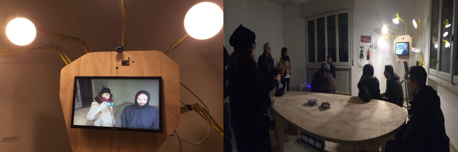
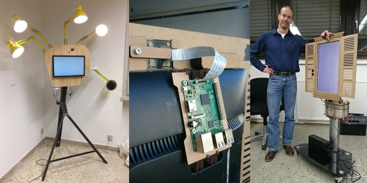

The EWindow is an electronic window open 24 hours a day on another space, 
as if the 2 windows were the extension of each room to the otherone, 
it allows a two-way audio video communication in real time. 

It has basic user interface and it doesn’t have mouse, keyboard, or other functions. 
It’s just a “window" in a wall.

The EWindow is:
### 1. __OPEN SOURCE__ 
// The code is [here](https://github.com/Zoxcore) enjoy it //

### 2. __DECENTRALIZED__ 
// No [central control](why.md) by some corporation using your data for other purposes //

### 3. __FREE__ 
// Everything (codes, hardware) is shared // [LEARN MORE](introduction.html)

# YOU WANNA MEET THE DEVELOPERS? 
They will present the eWindow and ToxBlinkenwall at the EASTEREGG CONFERENCE in Vienna, April 2019.
And once a year in October a small conference on the software upon is based the EWindow, called TOX, is organized in Vienna 
https://blog.tox.chat/

# STORY
We were looking for a way to connect shared workspaces like multifactories around the world.
After some years of trials and experiments on instant communication we decided it was time to do something bigger and we involved the Verbund Offener Werkstaetten (D) which decided to join us in the long process of making the community and spreading awarness around this theme. Then, to maintain the software development we created a small company TEILWERK.

[LEARN MORE](story.md)

# MAKE YOUR OWN NETWORK
If you like it but you are not part of a shared workspace (like a multifactory, a fablab, a coworking or a makerspace), if you think this device could improve communication inside your organisation or could just be cool to have it in your home to be connected with your sister and your mother but you are not a developer, we can help you to build one private network.

[LEARN MORE](buy.md)

# DESIGN 
There are different frame designs available, from more artistic one to certified one for public environments.

### Have a look to some [existing frames](frames.md)

# HARDWARE DEVELOPMENT
While starting this project one of the requirement was to find low-cost technologies. 
After many trials (and errors) we went up with a simple and accessible configuration.

[LEARN MORE ABOUT ELECTRONIC PARTS](hardware.md)

# SOFTWARE   

strfry and zoff with this project started their own adventure in developing a proper free software system of audiovideo communication.

The EWindows are based on a software developed for running on affordable technologies (such as Raspberry Pi *raspberryPi is a open-source hardware computer. is like a small computer that you can use for prototyping.*) and which uses a low bandwidth.

The OS is Raspbian which is a free operating system, optimized for the Raspberry Pi hardware, coincides with the open standards as is public, transparent and accessible to everyone. 

The added values of developing this NEW free software system are:
- eWindow system can be replicated anywhere in the world without hardware problems even in remote areas
- The software provides an encrypted and secure connection.

# COMMUNITY 
eWindows are a direct way to establish informal and unplanned connections. 
They can be useful for different situations and in different networks.

[LEARN MORE](community.md)

# FUTURE DEVELOPMENT

The EWindow is a technological tool to improve communication inside a specific community and it is not a personal communication tool.
It connects spaces.
The EWindow offers a third way.

[LEARN MORE](future.md)

# NEWSLETTER

<!-- Begin MailChimp Signup Form -->
<link href="//cdn-images.mailchimp.com/embedcode/classic-10_7.css" rel="stylesheet" type="text/css">

<form action="https://fablabdd.us3.list-manage.com/subscribe/post?u=787a4e76d86392475bc9dbff6&amp;id=5214318c17" method="post" id="mc-embedded-subscribe-form" name="mc-embedded-subscribe-form" class="validate" target="_blank" novalidate>
    

    <h2> If you would like to get updated, subscribe to our newsletter</h2>

* indicates required

    <label for="mce-EMAIL">Email Address  *
</label>
    <input type="email" value="" name="EMAIL" class="required email" id="mce-EMAIL">

    <label for="mce-FNAME">First Name </label>
    <input type="text" value="" name="FNAME" class="" id="mce-FNAME">

    <label for="mce-LNAME">Last Name </label>
    <input type="text" value="" name="LNAME" class="" id="mce-LNAME">

    <strong>Email Format </strong>
    <ul><li><input type="radio" value="html" name="EMAILTYPE" id="mce-EMAILTYPE-0"><label for="mce-EMAILTYPE-0">html</label></li>
<li><input type="radio" value="text" name="EMAILTYPE" id="mce-EMAILTYPE-1"><label for="mce-EMAILTYPE-1">text</label></li>
</ul>

    

        

        

    
    <!-- real people should not fill this in and expect good things - do not remove this or risk form bot signups-->
    
<input type="text" name="b_787a4e76d86392475bc9dbff6_5214318c17" tabindex="-1" value="">

    
<input type="submit" value="Subscribe" name="subscribe" id="mc-embedded-subscribe" class="button">

    

</form>

<!--End mc_embed_signup-->

# CONTACTS

[GET IN TOUCH WITH US](contacts.md)

